# 第一章：Linux基础-实验

## 软件环境

* Virtualbox
* Ubuntu 20.04 Server 64bit

## 实验问题


* 如何配置无人值守安装iso并在Virtualbox中完成自动化安装。
* Virtualbox安装完Ubuntu之后新添加的网卡如何实现系统开机自动启用和自动获取IP？
* 如何使用sftp在虚拟机和宿主机之间传输文件？


## 无人值守安装iso制作

### 实现特性

* 定制一个普通用户名和默认密码
* 定制安装OpenSSH Server


### 实验步骤

#### 下载并校验文件
- 在官方网站下载 `Ubuntu20.04`镜像文件
    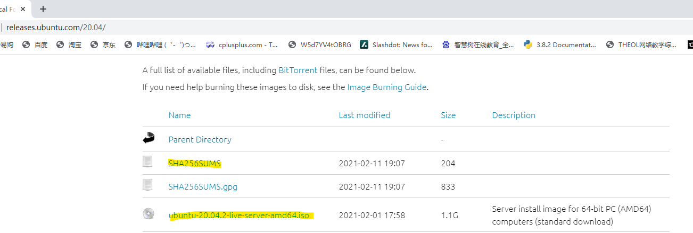

- 下载完成后利用SHA256进行哈希校验
   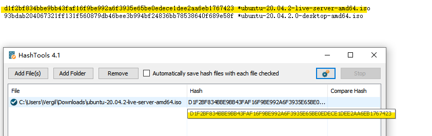

#### 配置虚拟机
- 挂载镜像文件，创建虚拟硬盘。
- 在 `NAT` 的基础上再开启另一块网卡 `Host-Only`
    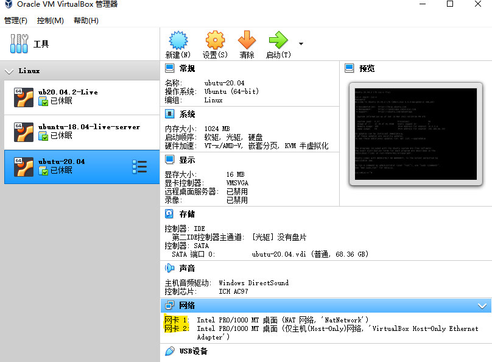
- 安装过程中定制安装`OpenSSH Server`

#### 建立宿主机连接
- 查看当前网卡状态，并获取ip
```
ip a
```
  
- 在cmd中通过ssh建立连接
```
ssh cuc-v@192.168.56.102
```


#### 定制镜像
  
- 将虚拟机自动配置描述文件下载至主机

```bash
# 进入root权限
sudo su -
# 查看配置文件
cat /var/log/installer/autoinstall-user-data
# 退出
exit
# 更改文件属主
sudo chown cuc-v:cuc-v /var/log/installer/autoinstall-user-data
```

- 将文件拷贝到主机桌面

```
exit
cd Desktop
scp cuc-v@192.168.56.102:/var/log/installer/autoinstall-user-data ./
```
  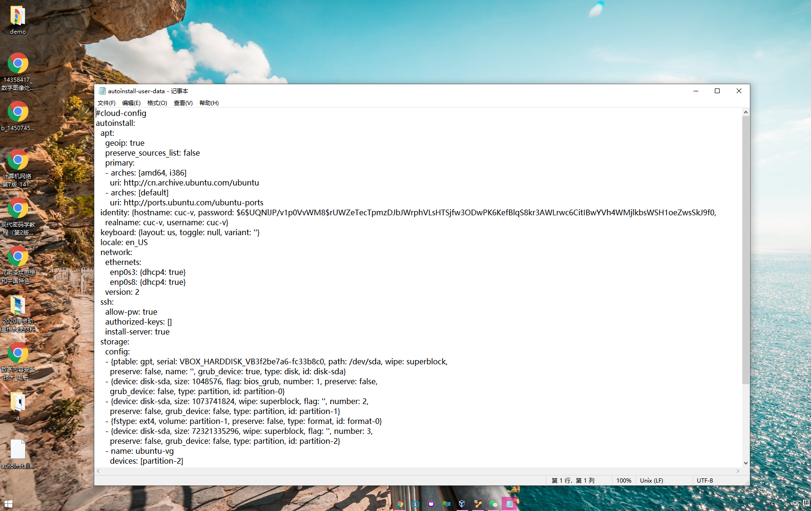

- 根据老师给的`user-data`文件，酌情修改配置文件

- 增加上海时区`timezone: Asia/Shanghai` 
- `locale`-> `en_US.UTF-8`
- 删除此硬盘分区`serial: VBOX_HARDDISK_VB449a92b3-120f2aae`。
- 修改`storge`中的各个`debices`的`size`:1GB、1MB、-1等人类理解的内容
  
  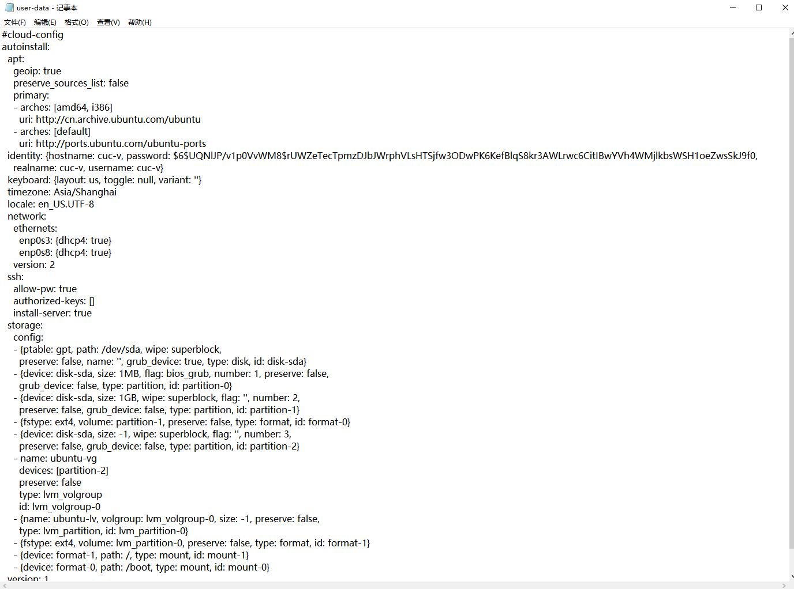

- 将配置文件拷贝至虚拟机
新建一个空文件`meta-data`

  

通过sftp连接宿主机，并传输这两个文件。

  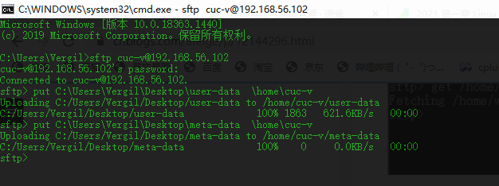


- 生成镜像

进入虚拟机

```bash
#安装依赖工具
sudo apt install genisoimage
# 创建cloud-init镜像
genisoimage -output init.iso -volid cidata -joliet -rock user-data meta-data
```
  

主机通过sftp将生成的镜像文件下载至本地

```
get home/cuc-v/init.iso C:/Users/Vergil/Desktop/
```

#### 实验结果

- 移除上述虚拟机「设置」-「存储」-「控制器：IDE」
  
- 在「控制器：SATA」下新建 2 个虚拟光盘，按顺序 先挂载「纯净版 Ubuntu 安装镜像文件」后挂载init.iso
  
  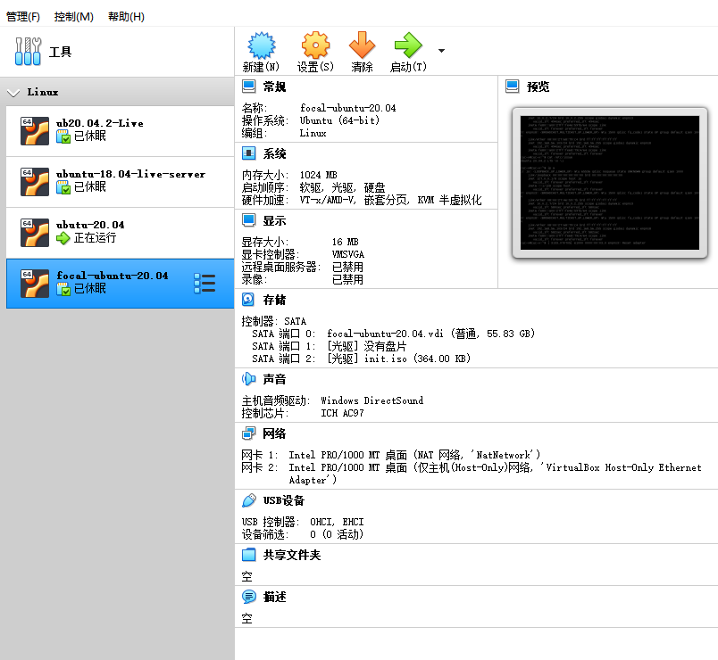

- 启动虚拟机
  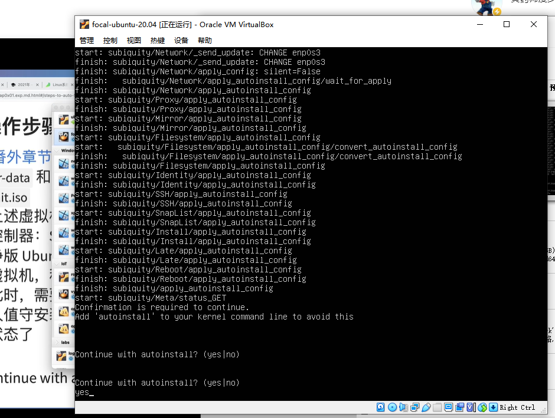
  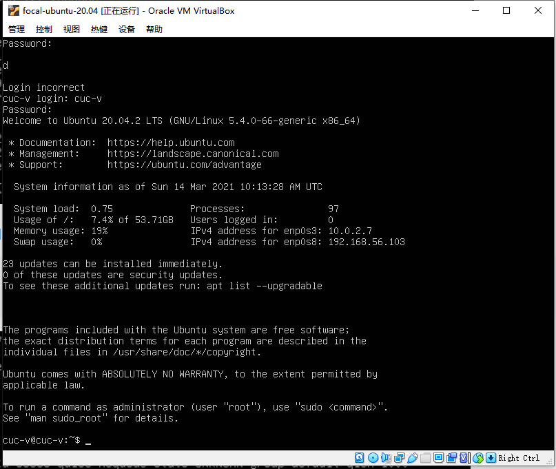  


---

## 实现系统开机自动启用网卡和自动获取IP

- 新建网卡
  
添加`host-only`网卡3

- 配置网卡
  
进入虚拟机输入命令`ip a`查看ip地址，发现新网卡未分配地址
  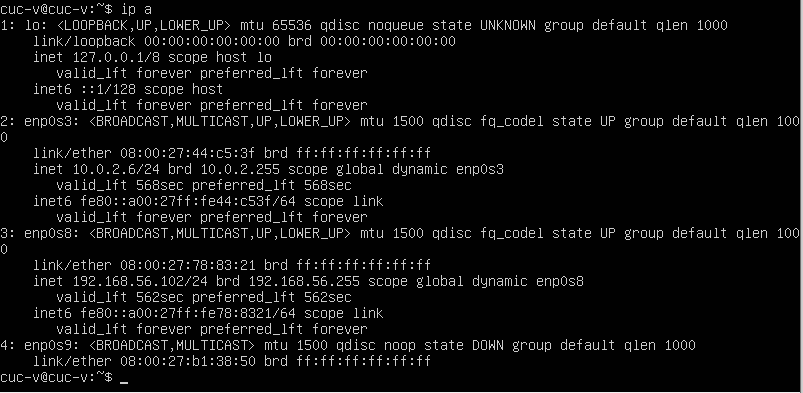 

用vim，打开网络配置文件

```
sudo vim /etc/netplan/00-installer-config.yaml
```

  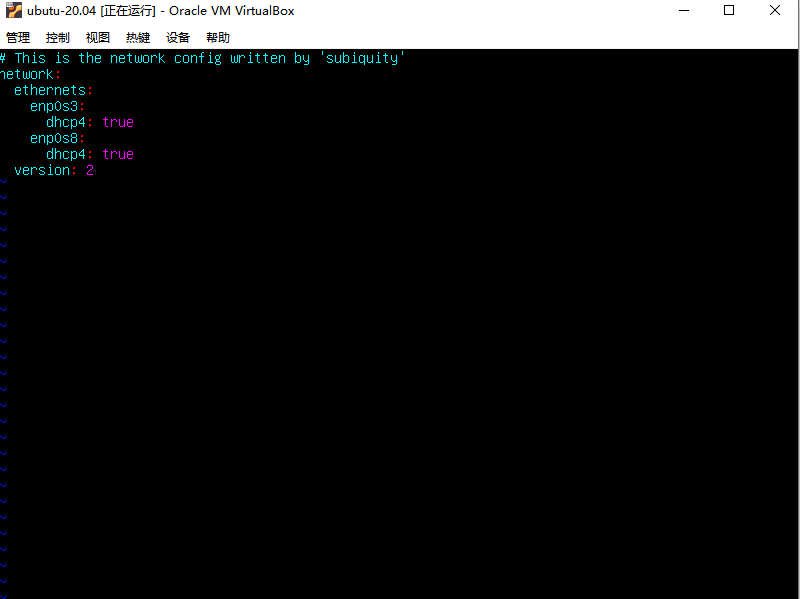

手动加入参数

  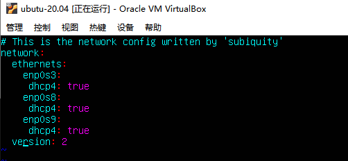

保存文件，退出程序，应用配置，查看ip地址。
```
:w
:q
sudo netplan apply
ip a
```

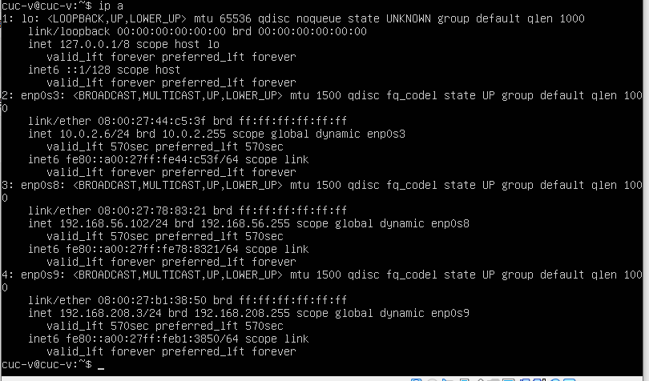


## 使用sftp在虚拟机和宿主机之间传输文件

- 当虚拟机开启了ssh后，宿主机可以使用sftp连接。

`sftp username@ip地址`

- 远程主机文件下载至本地

`sftp>get /home/www/download.txt E:/`

- windows本地文件/文件夹上传远程主机

```
sftp>put E:/test/upload.txt /home/www/
sftp>put -r E:/test     /home/www/
```

## 过程中遇到的问题
- 打开文件没权限  
  
  使用sudo进入root权限，更改文件属主。

- Ubuntu 20.04 Server 不会翻页
  
  网上查得知`shift+pgup/shift+pgdn`

- 主机下载虚拟机配置描述文件，生成镜像，无人值守安装失败。
  
  需要更改文件名字

- 实验完成后，ssh无法连接虚拟机
- 
  新建一个网卡并分配地址，ssh连接新网卡地址后，恢复正常。


  
## 参考资料

[课件](https://github.com/c4pr1c3/LinuxSysAdmin)

[教学视频](https://www.bilibili.com/video/BV1Hb4y1R7FE?p=28)

[吕师哥的实验报告](https://github.com/CUCCS/linux-2020-LyuLumos/blob/ch0x01/ch0x01/%E7%AC%AC%E4%B8%80%E6%AC%A1%E5%AE%9E%E9%AA%8C%E6%8A%A5%E5%91%8A.md)


[netplan.io](https://netplan.io/examples)

[sftp教程](https://www.cnblogs.com/afeige/p/12144296.html)
